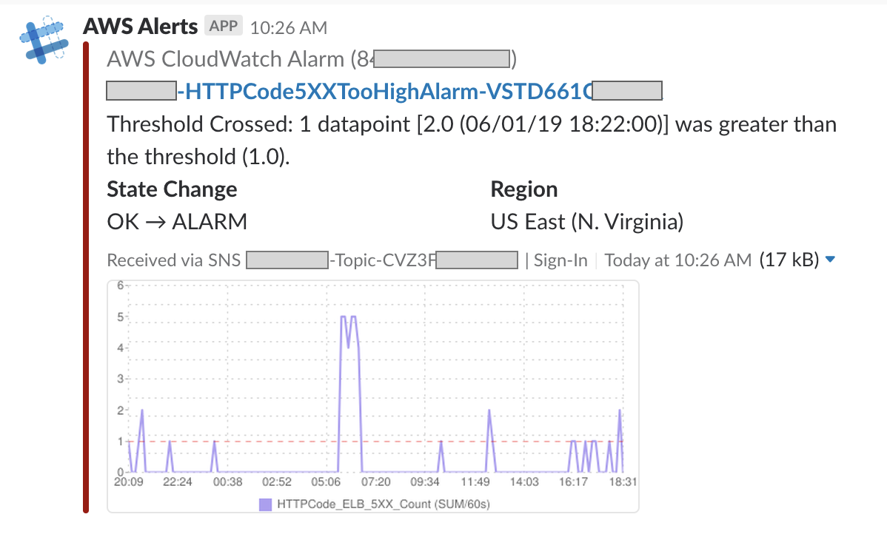
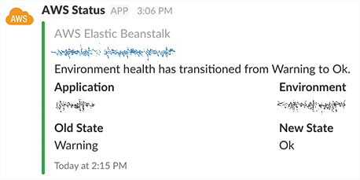
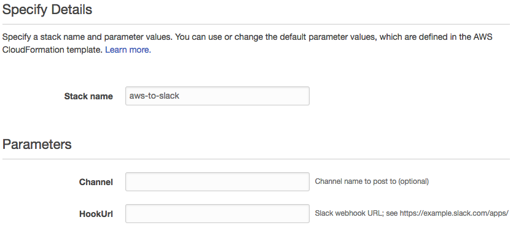
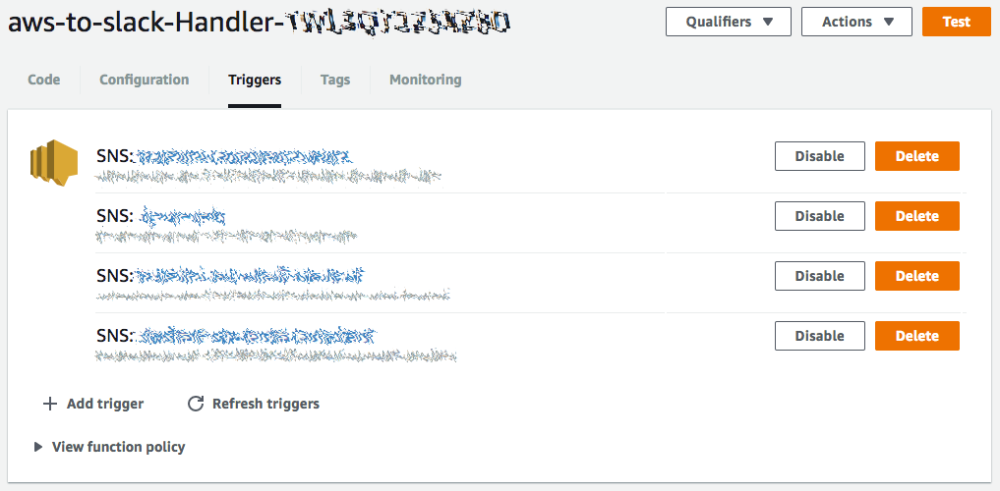

# AWS-to-Slack

[](https://www.npmjs.com/package/aws-to-slack)
[](https://github.com/arabold/aws-to-slack/blob/master/LICENSE)
[](https://www.npmjs.com/package/aws-to-slack)


Forward AWS CloudWatch Alarms and other notifications from Amazon SNS to Slack.





## What is it?
_AWS-to-Slack_ is a Lambda function written in Node.js that forwards alarms and
notifications to a dedicated [Slack](https://slack.com) channel. It self-hosted
in your own AWS environment and doesn't have any 3rd party dependencies other
than the Google Charts API for rendering CloudWatch metrics.

Supported notification formats:
* AWS Code Build
* AWS CodeCommit
* AWS CodeDeploy 🆕
* AWS CodePipeline 🆕
* AWS Health Dashboard
* Amazon GuardDuty 🆕
* Amazon Inspector
* Amazon SES Received Notifications
* CloudWatch Alarms (incl. Metrics)
* Elastic Beanstalk
* RDS
* Generic SNS messages
* Plain text messages

Additional formats will be added; Pull Requests are welcome!

## Try!
Ready to try it for yourself? Installation into your own AWS environment is as
simple as pressing the button below (for installation outside of `us-east-1` see details below):

[](https://console.aws.amazon.com/cloudformation/home?region=us-east-1#/stacks/new?stackName=aws-to-slack&templateURL=https://s3.amazonaws.com/aws-to-slack-us-east-1/cloudformation.yaml) 

## Installation

### Step 1 - Setup Slack
The Lambda function communicates with Slack through a Slack webhook
[webhook](https://your-slack-domain.slack.com/apps/manage). Note that you can either create an app, or a custom integration > Incoming webhook (easier, will only let you add a webhook)

1. Navigate to https://your-slack-domain.slack.com/apps/manage and click
   "Add Configuration".
2. Choose the default channel where messages will be sent and click
   "Add Incoming WebHooks Integration".
3. Copy the webhook URL from the setup instructions and use it in the next
   section.
4. Click "Save Settings" at the bottom of the Slack integration page.


### Step 2 - Configure & Launch the CloudFormation Stack

Note that the AWS region will be the region from which you launch the CloudFormation wizard, which will also scope the resources (SNS, etc.) to that region. 

Launch the CloudFormation Stack by using our preconfigured CloudFormation
[template](https://raw.githubusercontent.com/arabold/aws-to-slack/master/cloudformation.yaml) or
by simply pressing the following button:

| Region | Launch Stack |
|--------|--------------|
| us-east-1 | [](https://console.aws.amazon.com/cloudformation/home?region=us-east-1#/stacks/new?stackName=aws-to-slack&templateURL=https://s3.amazonaws.com/aws-to-slack-us-east-1/cloudformation.yaml) |
| us-east-2 | [](https://console.aws.amazon.com/cloudformation/home?region=us-east-2#/stacks/new?stackName=aws-to-slack&templateURL=https://s3.amazonaws.com/aws-to-slack-us-east-2/cloudformation.yaml) |
| us-west-1 | [](https://console.aws.amazon.com/cloudformation/home?region=us-west-1#/stacks/new?stackName=aws-to-slack&templateURL=https://s3.amazonaws.com/aws-to-slack-us-west-1/cloudformation.yaml) |
| us-west-2 | [](https://console.aws.amazon.com/cloudformation/home?region=us-west-2#/stacks/new?stackName=aws-to-slack&templateURL=https://s3.amazonaws.com/aws-to-slack-us-west-2/cloudformation.yaml) |
| ap-northeast-1 | [](https://console.aws.amazon.com/cloudformation/home?region=ap-northeast-1#/stacks/new?stackName=aws-to-slack&templateURL=https://s3.amazonaws.com/aws-to-slack-ap-northeast-1/cloudformation.yaml) |
| ap-northeast-2 | [](https://console.aws.amazon.com/cloudformation/home?region=ap-northeast-2#/stacks/new?stackName=aws-to-slack&templateURL=https://s3.amazonaws.com/aws-to-slack-ap-northeast-2/cloudformation.yaml) |
| ap-south-1 | [](https://console.aws.amazon.com/cloudformation/home?region=ap-south-1#/stacks/new?stackName=aws-to-slack&templateURL=https://s3.amazonaws.com/aws-to-slack-ap-south-1/cloudformation.yaml) |
| ap-southeast-1 | [](https://console.aws.amazon.com/cloudformation/home?region=ap-southeast-1#/stacks/new?stackName=aws-to-slack&templateURL=https://s3.amazonaws.com/aws-to-slack-ap-southeast-1/cloudformation.yaml) |
| ap-southeast-2 | [](https://console.aws.amazon.com/cloudformation/home?region=ap-southeast-2#/stacks/new?stackName=aws-to-slack&templateURL=https://s3.amazonaws.com/aws-to-slack-ap-southeast-2/cloudformation.yaml) |
| ca-central-1 | [](https://console.aws.amazon.com/cloudformation/home?region=ca-central-1#/stacks/new?stackName=aws-to-slack&templateURL=https://s3.amazonaws.com/aws-to-slack-ca-central-1/cloudformation.yaml) |
| eu-central-1 | [](https://console.aws.amazon.com/cloudformation/home?region=eu-central-1#/stacks/new?stackName=aws-to-slack&templateURL=https://s3.amazonaws.com/aws-to-slack-eu-central-1/cloudformation.yaml) |
| eu-west-1 | [](https://console.aws.amazon.com/cloudformation/home?region=eu-west-1#/stacks/new?stackName=aws-to-slack&templateURL=https://s3.amazonaws.com/aws-to-slack-eu-west-1/cloudformation.yaml) |
| eu-west-2 | [](https://console.aws.amazon.com/cloudformation/home?region=eu-west-2#/stacks/new?stackName=aws-to-slack&templateURL=https://s3.amazonaws.com/aws-to-slack-eu-west-2/cloudformation.yaml) |
| eu-west-3 | [](https://console.aws.amazon.com/cloudformation/home?region=eu-west-3#/stacks/new?stackName=aws-to-slack&templateURL=https://s3.amazonaws.com/aws-to-slack-eu-west-3/cloudformation.yaml) |
| sa-east-1 | [](https://console.aws.amazon.com/cloudformation/home?region=sa-east-1#/stacks/new?stackName=aws-to-slack&templateURL=https://s3.amazonaws.com/aws-to-slack-sa-east-1/cloudformation.yaml) |


**Afterwards**

Click "Next" and on the following page name your new stack and paste the
webhook URL from before into the "HookUrl" field. You can also configure a
different channel to post to if wanted.



Click "Next" again, complete the stack setup on the following pages and
finally launch your stack.

### Step 3 - Subscribe to Triggers

Before the Lambda function will actually do anything you need to subscribe it
to actual CloudWatch alarms and other SNS triggers. Open up the AWS Lambda,
switch to the "Triggers" tab and subscribe for all events you're interested in.




### Setting Up AWS CodeBuild
CodeBuild integration was suggested by [ericcj](https://github.com/ericcj) and is based on
the Medium post [Monitor your AWS CodeBuilds via Lambda and Slack](https://hackernoon.com/monitor-your-aws-codebuilds-via-lambda-and-slack-ae2c621f68f1) by
Randy Findley. 

To enable CodeBuild notifications add a new _CloudWatch Event Rule_, choose _CodeBuild_
as source and _CodeBuild Build State Change_ as type. As Target select the `aws-to-slack`
Lambda. You can leave all other settings as is. Once your rule is created all CodeBuild
build state events will be forwarded to your Slack channel.

### Setting Up AWS CodeCommit

Similar to the CodeBuild integration, CodeCommit notifications are triggered by
CloudWatch Event Rules. Create a new CloudWatch Event Rule, select _CodeCommit_
as the source, and select one of the supported event types:

* _CodeCommit Pull Request State Change_ - Will generate events when a pull
  request is opened, closed, merged, or updated.
* _CodeCommit Repository State Change_ - Will generate events when a branch
  or tag reference is created, updated, or deleted.

Add the `aws-to-slack` lambda as the target. No other settings are needed.

## Contributing

You want to contribute? That's awesome! 🎉

Check out our [issues page](https://github.com/arabold/aws-to-slack/issues) for
some ideas how to contribute and a list of open tasks. There're plenty of
notification formats that still need to be supported.

The repository comes with a very simple `Makefile` to build the CloudFormation
stack yourself. Simply run

```bash
make deps
make package
```

To generate a new `release.zip` in the `build` folder. Upload this zip to your
AWS Lambda function and you're good to go.
